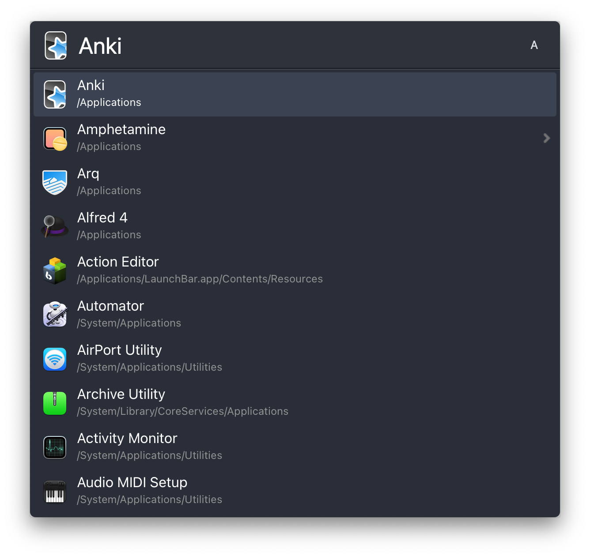

# Introduction

I've made this theme using the gorgeous [Nord Polar Night palette](https://www.nordtheme.com/docs/colors-and-palettes). Theme was made using the [Marshallvaugh's](https://github.com/marshallvaughn) [Sable](https://github.com/marshallvaughn/sable-launchbar-theme) theme, although I had to tweak it for changes made in the Default theme it inherits properties from and also, of course, the colours. Feel free to use it in any way you want. 

# How to install

